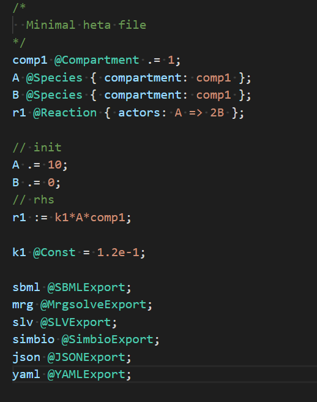

# heta-highlight-vscode package

The package is plugin for [Visual Studio Code](https://code.visualstudio.com/) editor to highlight the Heta language code.

This is part of [Heta project](https://hetalang.github.io/).

## Installation
1) From VSCode menu: **Extensions (Ctrl+ Shift +X) -> Search -> "heta"**
2) It is recommended to use "Dark+" or "Light+" theme. See File -> Preferences -> Color Theme

## Screenshot

